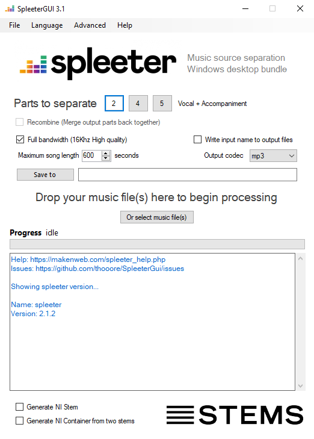

## SpleeterGUI - Music source separation desktop app  
Windows Desktop Front end for [Spleeter](https://github.com/deezer/spleeter) - AI source separation 

***THIS IS AN UPDATED VERSION OF [SPLEETERGUI](https://github.com/boy1dr/SpleeterGui/) WITH NO INSTALLER***

## Installation
1. Download the compiled binary folder from GitHub releases and place it wherever you want.
2. Download and extract [SpleeterCore](https://github.com/thooore/SpleeterCore)
3. Start SpleeterGUI (There could be an error message showing here, continue anyway!)
4. In SpleeterGUI select ***Advanced > Set SpleeterGUI Core path*** and select the path to where you unzipped SpleeterCore (The `root_folder.txt` of SpleeterCore should be in that folder)
5. Restart SpleeterGUI

This repository is a fork of the original [SpleeterGUI](https://github.com/boy1dr/SpleeterGui/)  which can be downloaded from [here](https://makenweb.com/SpleeterGUI).

The original project was developed by by [Maken It So](https://makenweb.com).
   
---
This new version (3.0) has some additional features:
- Generate [NI Stems](https://www.native-instruments.com/en/specials/stems/) for use in programs such as [Traktor](https://www.native-instruments.com/en/catalog/traktor/dj-software/)
- Different output formats
- Auto-name output files

---

This project is a C# desktop front end for Spleeter that adds the ability to create [NI Stems](https://www.native-instruments.com/en/specials/stems/).  

  

## Examples
https://www.youtube.com/watch?v=bdNzVPLzOLE  
https://www.youtube.com/watch?v=nxJfIsus0Ig  
https://www.youtube.com/watch?v=PHGAmZhuI-c  
https://www.youtube.com/watch?v=3X5nfc2d1Rw  
https://www.youtube.com/watch?v=9KkWJHC2bz0  
https://www.youtube.com/watch?v=Mygm1sFlQXc  

This project contains the C# source code for the Graphical User Interface. The GUI is an Windows Forms Application requiring Microsoft Visual Studio to build.

The [SpleeterGUI Core](https://github.com/thooore/SpleeterCore) required to run this program contains Python 3.7 and [Spleeter](https://github.com/deezer/spleeter). It contains everything you need to get up and running.

Feel free to inspect the source code and build for yourself.

## Help, FAQ and more
Check out the [Wiki](https://github.com/thooore/SpleeterGUI/wiki) for more information.
If you encounter a problem feel free to [create an issue](https://github.com/thooore/SpleeterGUI/issues/new)!

***

Also huge thanks to the original creator [Maken It So](https://makenweb.com/) for creating such a useful program!