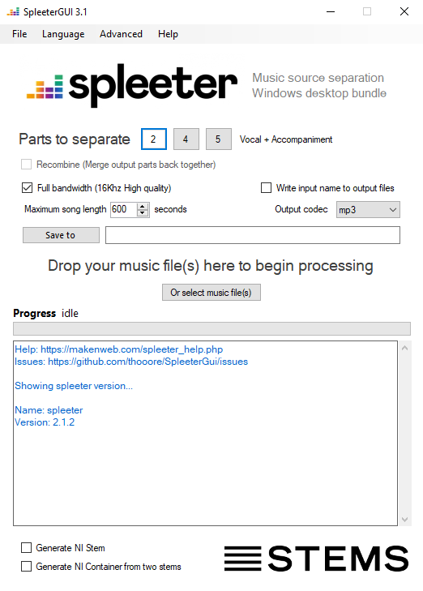

## SpleeterGUI - Music source separation desktop app  
Windows Desktop Front end for [Spleeter](https://github.com/deezer/spleeter) - AI source separation 

***THIS IS AN UPDATED VERSION OF SPLEETERGUI WITH NO INSTALLER***

## Installation
1. Download the compiled binary folder from GitHub releases and place it wherever you want.
2. Download and install [SpleeterCore](https://github.com/thooore/SpleeterCore)
3. Start SpleeterGUI
4. In SpleeterGUI select ***Advanced > Set SpleeterGUI path*** and select the path to where you unzipped SpleeterCore (The `root_folder.txt` of SpleeterCore should be in that folder)
5. SpleeterGUI should now be work!

This repository is a fork of the original [SpleeterGUI](https://github.com/boy1dr/SpleeterGui/) which can be downloaded from [here](https://makenweb.com/SpleeterGUI) and has a [FAQ](https://makenweb.com/spleeter_help) that is still relevant
   
---

No need to install python or spleeter, this app contains a portable version of python pre-loaded with Spleeter.  

The aim for this project is to make it easy for Windows users to download and run Spleeter without needing to use the command line tools to do so.  

  

This project is a simple C# desktop front end for Spleeter.  

## Examples
https://www.youtube.com/watch?v=bdNzVPLzOLE  
https://www.youtube.com/watch?v=nxJfIsus0Ig  
https://www.youtube.com/watch?v=PHGAmZhuI-c  
https://www.youtube.com/watch?v=3X5nfc2d1Rw  
https://www.youtube.com/watch?v=9KkWJHC2bz0  
https://www.youtube.com/watch?v=Mygm1sFlQXc  

This project contains the C# source code for the Graphical User Interface. The GUI is an Windows Forms Application requiring Microsoft Visual Studio to build.
The [SpleeterGUI Core](https://github.com/thooore/SpleeterCore) required to run this program contains Python3.7 and the Spleeter project.

Feel free to inspect the source code and build for yourself. You can also install your own python/tensorflow/ffmpeg/spleeter.

There can be some bugs with the recombine feature in combination with the auto-naming and codec options. If you encounter a bug, you can leave an issue explaining what happened or a pull request if you want to fix it yourself.
